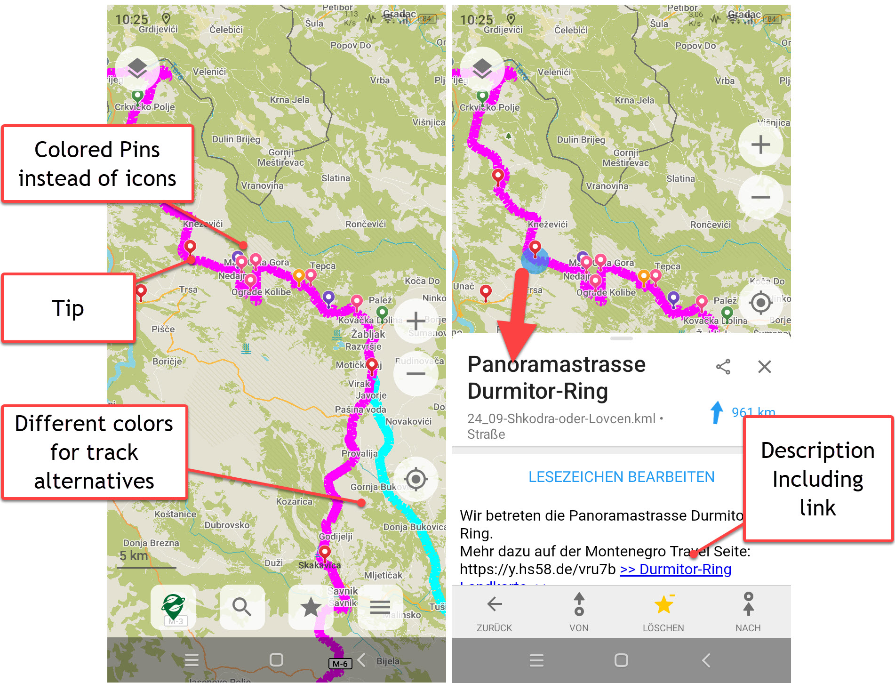

# GPX_2_KML_4_Orga
## Version and licence
Version v2.0 dated 11/2024 
Written by Hans Strassguetl - https://gravelmaps.de   
Licenced under [https://creativecommons.org/licenses/by-sa/4.0/](https://creativecommons.org/licenses/by-sa/4.0/)
## About
Convert GPX files exported from Garmin Basecamp in one go into a meaningful KML file that can be imported by Maps.me or Organic.Maps.

Be aware

- Basecamp uses a Garmin implementation of GPX that differs from the standard GPX in aspects like colour. To receive a full set of features, make sure you source your tracks and waypoints from Garmin Basecamp.
- Even if the App is designed to use Garmin GPX files, it works with standard GPX files too.
- Files converted by this App won't fully support all features of OruxMaps as they have implemented their own KML structure. In case you want to use OruxMaps, use **GPX\_2\_KML\_4\_Orux**.

## Use:
### Planning: 
Planning is done in Garmin Basecamp. 
- Waypoints shall be named without special characters (ä/ö/ü etc)
- Waypoints may include a description
- Waypoints description may contain links
- Tracks shall be named without special characters (ä/ö/ü etc)
- Routes will not be considered as routes do not have reasonable track values.
- Export data via Basecamp File -> Export function.

### Conversion
GPX_2_KML_4_Orga has no user interface. You just take your exported GPX and drag & drop it onto the exe. As a result you have a converted KML with the same name in the same directory as the GPX.
If there are any errors, you will be informed.

## Example ##

Planning in Basecamp:  

Result in OrganicMaps:  

## Data privacy ##
- By design XML structures as GPX and KML reach out for external servers. For example, interpreting the Garmin GPX, you will find certain html addresses in the GPX's header that support interpreting the structure.
- The OrganicMaps Pins need no external access by this program.

## Read more ##

If you want to understand more in terms how you can customize icons and tracks colors, read: **readme-licence.pdf**
